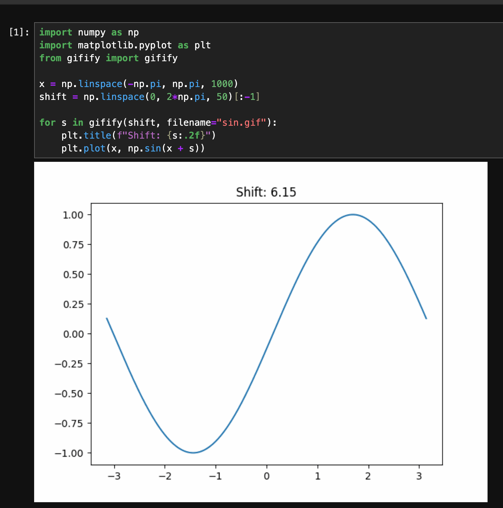

# Gifify

Make a gif out of a loop of `matplotlib` plots.

# Install

`pip install gifify`

# Example

```python
import numpy as np
import matplotlib.pyplot as plt
from gifify import gifify

x = np.linspace(-np.pi, np.pi, 1000)
shift = np.linspace(0, 2*np.pi, 50)[:-1]

for s in gifify(shift, filename="sin.gif"):
    plt.title(f"Shift: {s:.2f}")
    plt.plot(x, np.sin(x + s))

```

The above code creates the following gif:


# Jupyter notebook support

The created gif is displayed in the notebook if the code is run in a Jupyter notebook.
This can be turned off by setting `display=False` in the `gifify` function.



# TODO

-   [ ] Add ability to pass artists and other options to the `plt.savefig` call
-   [ ] Fix issue where the gif doesnt loop when displayed in the notebook
-   [ ] Add controls to the gif in the notebook
-   [ ] Add support for other formats beyond gifs
